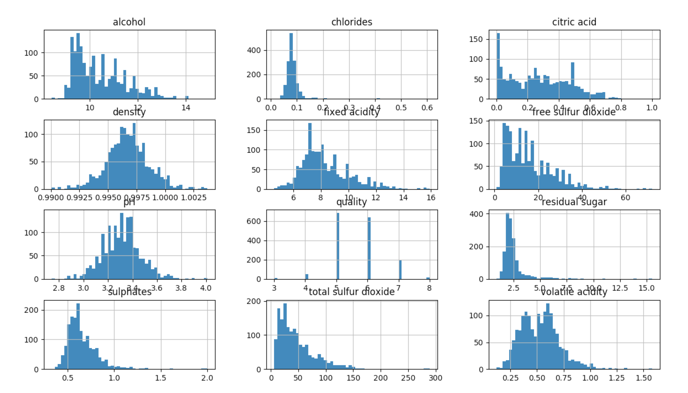
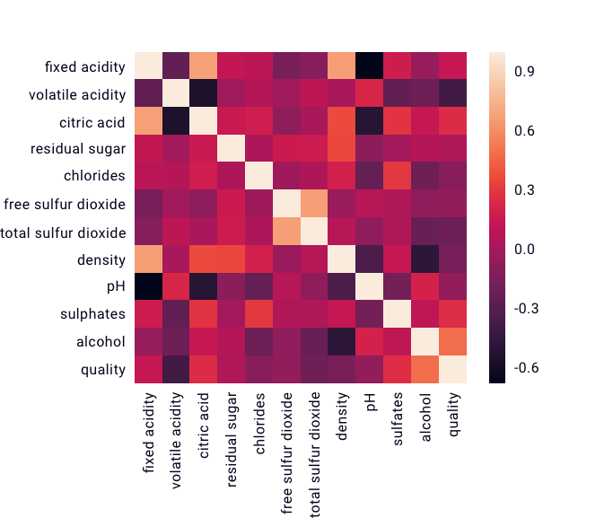
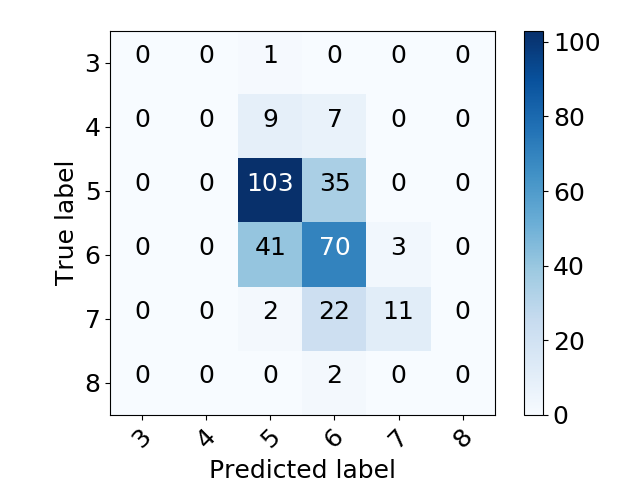

Wine-Quality-Predictor
======
**The goal of this program is to predict the quality score of a red wine given it's chemical properties... and to teach myself regression.** 
Each wine in the dataset has the following attributes: fixed acidity, volatile acidity, citric acid, residual sugar, chlorides, free sulfur dioxide, total sulfur dioxide, density, pH, sulphates, alcohol, and quality. Quality is an ordinal value between 0 (low) and 10 (high), scored by wine-tasting professionals. After evaluating five different estimators, I chose support vector regression and obtained a root-mean-square error of 0.64 on the validation set.

## How to Run

All dependencies are stored in venv and can be accessed by activating the virtual environment. Then, simply run ```python testing.py``` to predict
the quality of each wine in the test set and display the estimator's RMSE.

## Build Overview

I began by plotting histograms for each feature:





Most quality scores hover around 5, 6, and 7. Predictions will likely hover around the same values, which could make extremes more difficult to predict. Alcohol, citric acid, free sulfur dioxide, and total sulfur dioxide also have significantly tail-heavy distributions. Applying a log transformation could normalize these attributes – todo! Lastly, most attributes had a lot of outliers. Because of this, standardization was used instead of min-max scaling.


I then plotted a correlation matrix between each feature and quality:





It's clear that pH and citric acid are strongly correlated with many other attributes. They were found to slightly improve performance when dropped from the feature set. Attribute consolidation (notably free SO2 / total SO2 and volatile acidity / fixed acidity ratios) was attempted but worsened performance. Alcohol has the most positive correlation with quality and volatile acidity the most negative. As these are important attributes, stratified sampling ought to be applied when splitting the data into a training and test set – todo!


From here, I instantiated linear, decision tree, random forest, and support vector regressors and fitted each with the training set. A grid search was employed to find the best-performing hyperparamater values for each model––perfomance being measured using 5-fold cross validation. The prevailing model was a support vector regressor with a radial kernel and the following paramaters: epsilon=0.1, C=1, gamma=0.01.


Finally, I ran the model on the test set and obtained a RMSE of 0.71. A confusion matrix is then plotted to get a better picture of the model's performance:





As expected, 5, 6, and 7 were easier to predict than the rest.

## To-Do

* Provide support for custom input data

* Logarithm transform tail-heavy attributes

* Apply stratified sampling for alcohol and volatile acidity

* Create a single pipeline that does the full data preparation plus the final prediction
